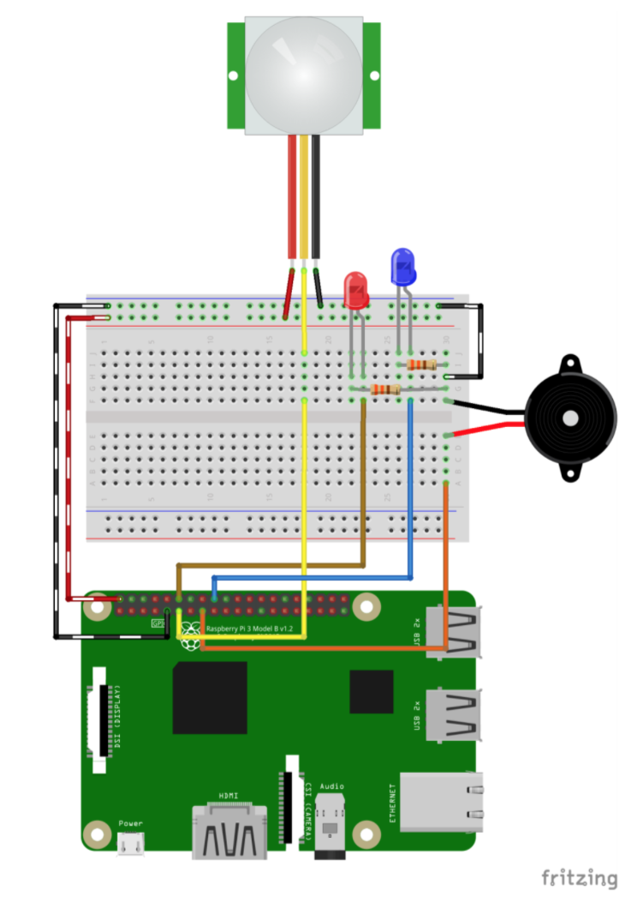

TP Mouvement
=============
_infos pratiques_ : tous les raspberry ont pour login `pi` et pour mot de passe `raspberry`

1ère partie : Capteur de mouvement
---------------------------------- 

. Réalisez ce montage : 


_Lorsque le capteur détecte un mouvement, il envoie un signal sur son fil jaune. Nous allons donc configurer notre raspberry pour recevoir ce signal sur un de ses GPIOs_  

. Créez le fichier `movement.py` : 


```python
import RPi.GPIO as GPIO
import time

# Initialisation de notre GPIO 17 pour recevoir un signal
# Contrairement à nos LEDs avec lesquelles on envoyait un signal
broche=17
GPIO.setmode(GPIO.BCM)
GPIO.setwarnings(False)
GPIO.setup(broche, GPIO.IN)

currentstate = 0
previousstate = 0

# Boucle infini jusqu'à CTRL-C
while True:
    # Lecture du capteur
    currentstate = GPIO.input(broche)
		 # Si le capteur est déclenché
    if currentstate == 1 and previousstate == 0:
        print("    Mouvement détecté !")
        # En enregistrer l'état
        previousstate = 1
    # Si le capteur est s'est stabilisé
    elif currentstate == 0 and previousstate == 1:
        print("    Prêt")
        previousstate = 0
    # On attends 10ms
    time.sleep(0.01)

```

. Une fois que tout fonctionne correctement, modifiez le script pour allumer/éteindre une LED lorsqu'il y a du mouvement. (si vous avez le temps, ajoutez le buzzer pour qu'il sonne pendant 1 s dès qu'il y a du mouvement également.)

